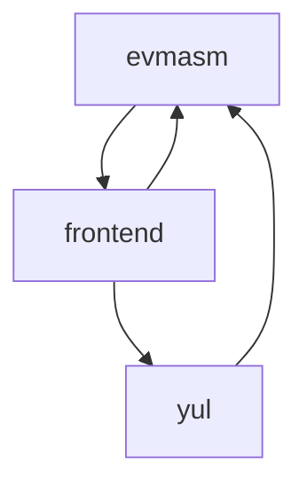

# [\#13405 PR](https://github.com/ethereum/solidity/pull/13405) `merged`: [libevmasm] Add Assembly::OptimiserSettings::translateSettings.
**Labels**: `priority review`, `refactor`

#### [aarlt](https://github.com/aarlt) opened issue at [2022-08-16 16:13](https://github.com/ethereum/solidity/pull/13405):

We had in the past some discussion about having such function.

- https://github.com/ethereum/solidity/pull/10286#issuecomment-827969786
- https://github.com/ethereum/solidity/pull/11550#discussion_r653680572
- https://github.com/ethereum/solidity/pull/12834#discussion_r869153232

I think, at least with the current source, such function is not introducing any additional dependencies. But maybe it is possible to clean up the dependencies. However, I created this PR so that we can discuss this.

@axic @cameel @chriseth 

#### [matheusaaguiar](https://github.com/matheusaaguiar) commented at [2022-08-24 15:32](https://github.com/ethereum/solidity/pull/13405#issuecomment-1225885840):

I read through the mentioned PRs and looked at the changes. The removal of the duplicated code is really nice and as you said, it doesn't introduce any additional dependencies.
Thinking about how to remove the already present dependencies, regarding `OptimiserSettings`, maybe it could be moved to a common place that is shared by `libyul`, `libsolidity` and `libewasm`.

#### [axic](https://github.com/axic) commented at [2022-09-27 15:29](https://github.com/ethereum/solidity/pull/13405#issuecomment-1259676132):

My main concern was the cross-dependency we are introducing:

The code deduplication is welcome. Perhaps one way to make this nicer is moving `interface/OptimiserSettings.h` to `libsolutil` or `liblangutil`?

I won't contest it however.

#### [cameel](https://github.com/cameel) commented at [2022-10-21 22:40](https://github.com/ethereum/solidity/pull/13405#issuecomment-1287503491):

> The code deduplication is welcome. Perhaps one way to make this nicer is moving `interface/OptimiserSettings.h` to `libsolutil` or `liblangutil`?

I guess we could do that, though it does seem a bit out of place there (it is not a general utility, it's really closely tied to compiler features, just in to separate libs).

IMO, we might be better off just merging this and untangling the dependency cycle at the point when we'll actually need to make `libevmasm` independent. As @aarlt said, the cyclical dependency already exists, even without this PR.

#### [cameel](https://github.com/cameel) commented at [2022-10-26 12:12](https://github.com/ethereum/solidity/pull/13405#issuecomment-1291940188):

I'm going to merge this and let's deal with severing the dependencies once it becomes an actual issue.

-------------------------------------------------------------------------------

[Export of Github issue for [ethereum/solidity](https://github.com/ethereum/solidity). Generated on 2024.12.15 at 06:45:24.]
